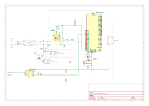

# STM-Auto: Oil Monitor System

This is a temperature monitoring system for the SWEE.BRZ vehicle using an STM32 Blue Pill microcontroller.

## Overview

This project monitors oil temperature via a resistance-based sensor and automatically controls a servo-driven flap valve based on temperature thresholds. Status is displayed on a 128x64 OLED screen.

## Hardware

- **MCU**: STM32F103C8 (Blue Pill)
- **Display**: SSD1306 OLED (128x64) via I2C
- **Sensor**: Temperature resistor on PA1
- **Actuator**: Servo motor on PA6
- **Connections**:
  - OLED SDA: PB11
  - OLED SCL: PB10

## Configuration

Key parameters in `main.cpp`:

- `TEMP_RESISTANCE_THRESHOLD`: Temperature threshold for flap control (default: 1000 Ω)
- `TEMP_SERIES_RESISTOR`: Series resistor value (default: 220 Ω)
- Servo angles: Closed (0°), Open (90°)

## Building & Uploading

```bash
platformio run -e bluepill_f103c8 -t upload
```

Monitor serial output at 115200 baud.

## Dependencies

- Adafruit SSD1306
- Adafruit GFX Library
- Arduino framework for STM32

## Schematics

The kicad project [is available here](kicad/stm-auto/)


