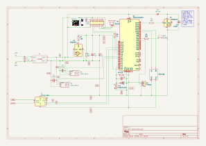

# STM-Auto — SWEE.BRZ Oil Monitor

[](https://github.com/raphaeltournafond/STM-Auto/actions/workflows/ci.yml)

Firmware for an oil **temperature** and **pressure** monitor on an STM32F103C8T6 "Blue Pill",
built with PlatformIO + the Arduino-STM32 core. It reads the two sensors, regulates oil temperature
by opening/closing **twin flap servos**, raises tiered alerts, and shows live status on a 128×64
SSD1306 OLED.

The full behavioural specification (life phases, the priority-ordered situation matrix, adaptive
pressure floors, hysteresis, acknowledgement and voice messages) lives in
[`DECISION_MATRIX.md`](DECISION_MATRIX.md).

## Features

- **Dual sensing** — oil temperature (resistance → °C) and pressure (voltage → bar), via
  piecewise-linear sensor scales.
- **Thermal regulation** — twin flap servos driven in tandem, with temperature hysteresis
  (open 92 °C / close 85 °C) to avoid chatter.
- **Situation decision matrix** — every cycle picks the single highest-priority situation
  (sensor faults → stop-engine → low pressure → overpressure → overheat → normal bands) and drives
  the outputs accordingly, including an **adaptive low-pressure floor** that depends on the
  temperature band.
- **Fail-safes** — flap defaults open on any doubt; sensor faults are detected on the raw signal
  (resistance / voltage) before conversion.
- **Status display** — temperature, pressure, flap state and alert banner on the OLED, plus an
  onboard backup alert LED.
- **Tested** — pure decision logic is unit-tested on the host and gated by CI.

## Hardware

- **MCU:** STM32F103C8T6 "Blue Pill"
- **Display:** SSD1306 OLED 128×64 (I²C)
- **Programmer:** ST-Link (`upload_protocol = stlink`)

Pin map (source of truth: [`src/pins.h`](src/pins.h)):

| Function | Pin(s) | Function | Pin(s) |
|---|---|---|---|
| Pressure sensor | `PA0` | Buzzer (`tone()` → TIM3) | `PB6` |
| Temperature sensor | `PA1` | OLED SCL / SDA (I2C2) | `PB10` / `PB11` |
| Flap servos ×2 (`Servo` → TIM2) | `PA6` / `PA7` | WS2812B RGB LED (SPI2 MOSI+DMA) | `PB15` |
| MP3 module (USART1) | `PA9` / `PA10` | Onboard backup LED | `PC13` |
| CAN RX / TX | `PA11` / `PA12` | ACK touch button | `PB5` |

Per-peripheral wiring decisions (supply rails, level handling, supporting parts) are documented in
[`kicad/stm-auto/WIRING.md`](kicad/stm-auto/WIRING.md).

## Getting started

Requires [PlatformIO](https://platformio.org/).

```bash
pio run -e bluepill_f103c8            # build firmware
pio run -e bluepill_f103c8 -t upload  # flash via ST-Link
pio device monitor -b 115200          # serial monitor @ 115200 baud
pio test -e native                    # run unit tests on the host (no hardware)
pio run -t clean                      # clean
```

Library dependencies (auto-installed): Adafruit SSD1306 + Adafruit GFX (firmware), Unity (tests).

## Architecture

- **`lib/`** — **pure, Arduino-free** logic: `decision/` (situation matrix, hysteresis, interpolation,
  sensor conversions), `ws2812/` (WS2812B pixel → SPI byte encoding), `buzzer/` (alert patterns +
  envelope), and `ack/` (acknowledge state machine). State is passed in as parameters, so it builds and
  runs natively and is fully unit-testable.
- **`src/main.cpp`** — owns all hardware I/O (servos, OLED, ADC, LEDs, SPI, serial) and the evolving
  state, calling into `lib/` each 200 ms loop.

```
src/            firmware (main.cpp, pins.h)
lib/            pure libraries (decision, ws2812) — unit-tested
test/           Unity test suites (native)
kicad/stm-auto/ schematic, PCB, wiring notes
```

## Tests & CI

The pure decision logic has a host-native test suite (Unity):

```bash
pio test -e native
```

[GitHub Actions](.github/workflows/ci.yml) runs the unit tests and the firmware build on every pull
request and on pushes to `main`.

## Status

**Implemented:** temperature + pressure reading, twin-servo thermal regulation with hysteresis, the
full situation decision matrix with adaptive low-pressure floor, OLED status display, WS2812B RGB
alert indicator (off/yellow/red) with onboard backup LED, buzzer alert patterns, ACK touch button
(mutes sound, §6), native tests + CI.

**Wired but not yet coded** (pins assigned, schematic complete): MP3 voice prompts, CAN / engine-RPM
input. See `DECISION_MATRIX.md` for the roadmap.

## Schematics

The KiCad project is [available here](kicad/stm-auto/).


